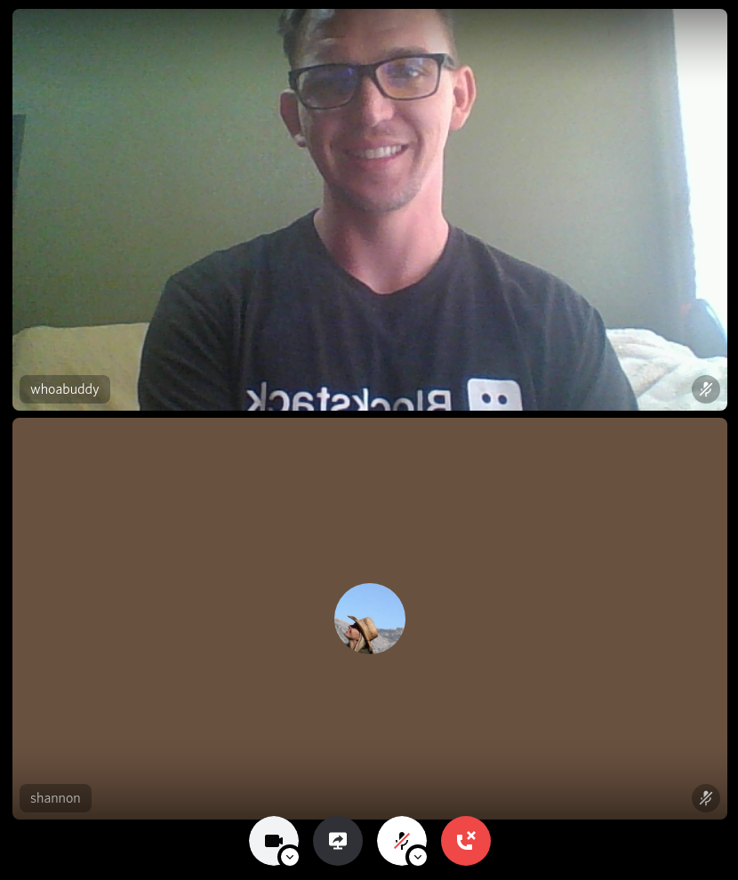
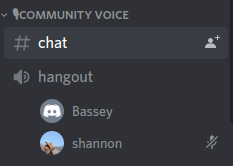

Trying new things is hard, and learning them on the fly during a presentation in front of an audience is even harder.

Below is a comprehensive walkthrough of some basic Discord chat functions, tailored specifically toward the Stacks hangouts that happen in the community channel.

The original content is hosted on Sigle, [read more here!](https://app.sigle.io/whoabuddy.id.blockstack/IFT64oGIRG6yvFF4LB0UW)