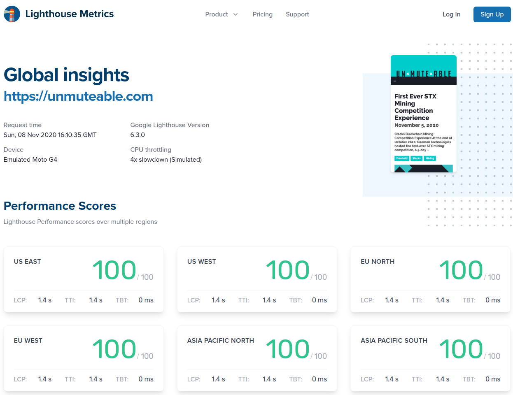
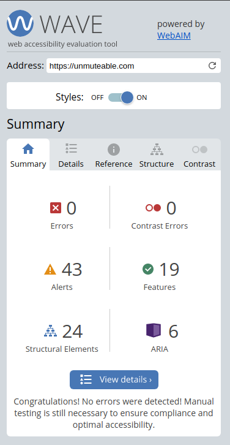
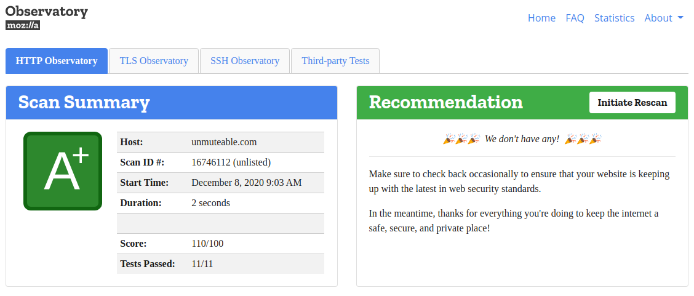
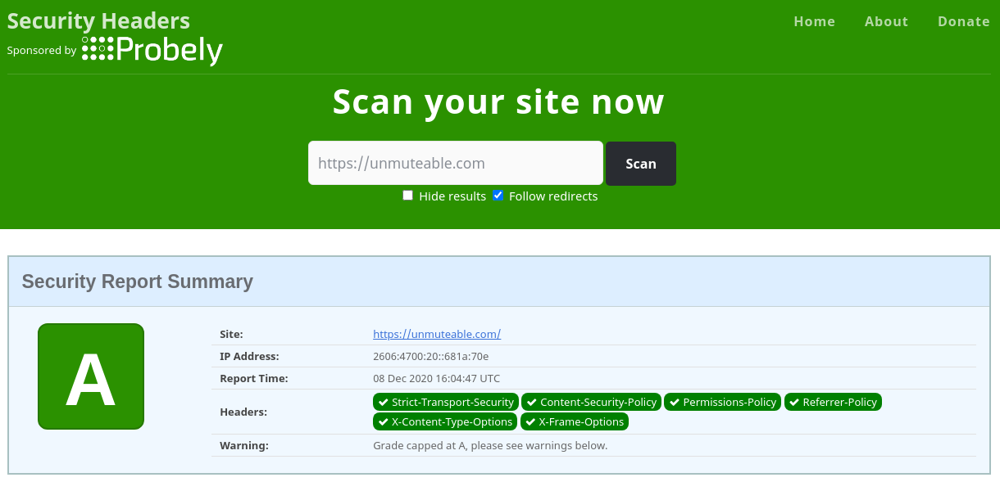
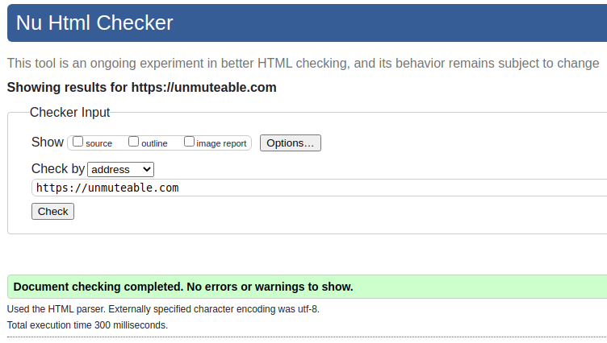

## Intro

> Words are but a means to meaning, and for those who will listen, the enunciation of truth.
> V for Vendetta (2005)

When presented with an opportunity to share my words via this publication, and while initially it came as an unexpected surprise, the concept quickly became an inner responsibility to represent a collection of voices via educational content, encouraging others to join in and do the same.

It all started with the name **UN x MUTE x ABLE**. A subtle play on the immutability of a blockchain, and the opportunity to express an independent fact-focused opinion about crytpocurrency, decentralization, user privacy, and sovereign identity.

## The road less traveled

In starting this journey, it was immediately apparent that we had to stand up against the “old” way of doing things, much like crypto is challenging the structure of the traditional web as we know it. This meant sacrificing convenience, which in itself is the sirens’ song that has led to the current state of surveillance capitalism.

With that, we chose to focus on core values inspired by Stack's mission of a building user-owned Internet, the Free Software Foundation’s (FSF) fight for user freedom, and the Electronic Frontier Foundation’s (EFF) defensive stance surrounding digital privacy, free speech, and innovation.

To express that through a website, it meant making some decisions that deviated from typical development routes.

For domain registration, DNS management, and website hosting we chose [Cloudflare](https://www.cloudflare.com/) based on their mission.

> Help us build a better Internet
> At Cloudflare, we have our eyes set on an ambitious goal — to help build a better Internet. We believe that with our talented team, smart technology and engaged users we can solve some of the biggest problems on the Internet.

For creating a blog, we wanted to move away from traditional database-backed solutions, and chose [Hugo](https://gohugo.io) as the static site generator enabling us to embrace [JAMstack principles](https://jamstack.org/why-jamstack/).

Instead of copying an existing theme, we rolled our own, using [Bulma](https://bulma.io) for the layout and running with the rest.

On the back-end of the blog everything is open source and stored [on GitHub](https://github.com/AbsorbingChaos/unmuteable-com), which is automatically deployed via GitHub Actions.

On the front-end, we chose [Forestry](https://forestry.io) as the headless CMS, which integrates well with Hugo and GitHub, as well as provides a simple, easy-to-use interface for writers.

## The fruits of labor

Speed tests show that using Cloudflare as a CDN is definitely worth it, and serving content from the edge in over [200 cities in more than 100 countries](https://www.cloudflare.com/network/) has an awesome result.

Often overlooked in website design, the WCAG 2.0 standard helps identify errors on websites that lead to accessibility issues. Our contrast is in check, and our code provides the necessary tags to navigate the website with alternate readers.

Going with a static site generator eliminates a lot of security concerns found in a traditional web server and database configuration, but it doesn’t guarantee the web host or service will deliver with top-notch standards.

That’s where Cloudflare Workers shines - we can modify the headers sent back on our request and in doing so bring the site up to today’s standards and beyond.

Last one will be valid website code, respecting the HTML at the core and adding a big nod to Bulma for adding the ability to style the site without adding anything that gets tagged here. Run any other website through the nu html checker and I bet you’ll be surprised at what you find.

## Vision for the future

Where can we go from here? The goal is to have difficult conversations, honest analysis, and dive deep into the philosophy and ethics behind crypto, decentralization, and what it can provide to the world.
